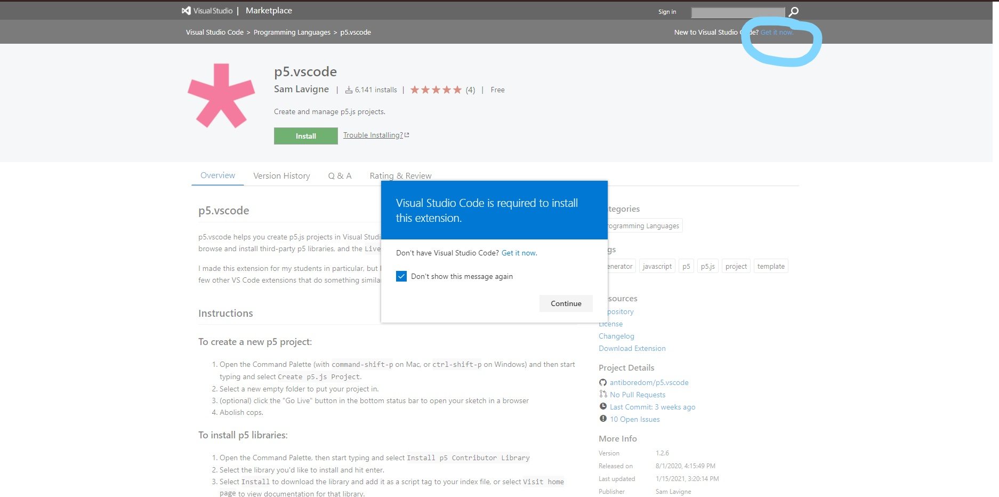

# Setting up your Environment

### Sublime Text and BrowserSync

1. Download [Sublime](https://www.sublimetext.com/3)
2. In Sublime, hit ctrl+shift+p (cmd+shift+p on Macs) and type Install Package Control and hit enter. You will see the request processing at the bottom of the screen, soon another dropdown window should appear.
3. Type BrowserSync and hit Enter
4. Now you should have a BrowserSync menu on Sublime. You can now choose your index.html file as your Start File and then select Launch.

(Warning - there is a documented bug wit BrowserSync and Macs)

### Visual Studio Code

**Instructions for Mac Users:**

1. Go to https://marketplace.visualstudio.com/items?itemName=samplavigne.p5-vscode

2. Click the green Install button, if you don't have VS Code, you will be prompted to install it, the link in the pop up window did nothing for me so

3. Install VS Code by clicking in the upper right corner as shown below

   

4. Once VS Code is installed repeat step 1 and 2

5. Click install as shown below

   

6. Follow the instructions from the link in step 1 To create a new p5 project

**Instructions for Window Users:**

1. Go to https://marketplace.visualstudio.com/items?itemName=samplavigne.p5-vscode

2. Click the green Install button, if you don't have VS Code, you will be prompted to install it

3. Once VS Code is installed repeat step 1 and install p5.vscode

4. Click install as shown in the image below

   

5. Follow the instructions from the link in step 1 To create a new p5 project

And one benefit of this plugin, is that is automatically sets up the p5 libraries, index.html, sketch.js, and style.css files for you.